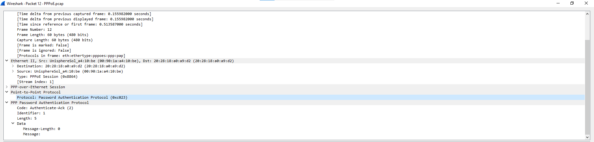
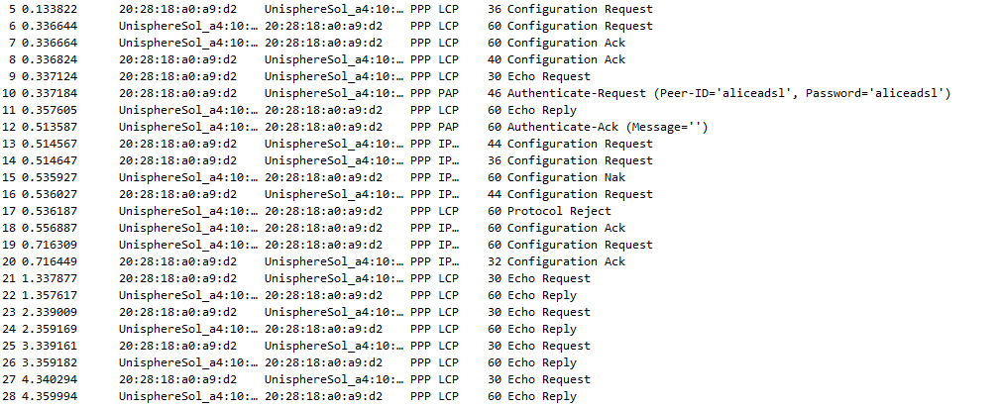
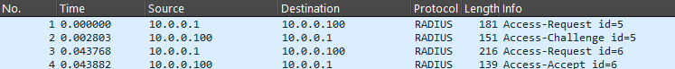
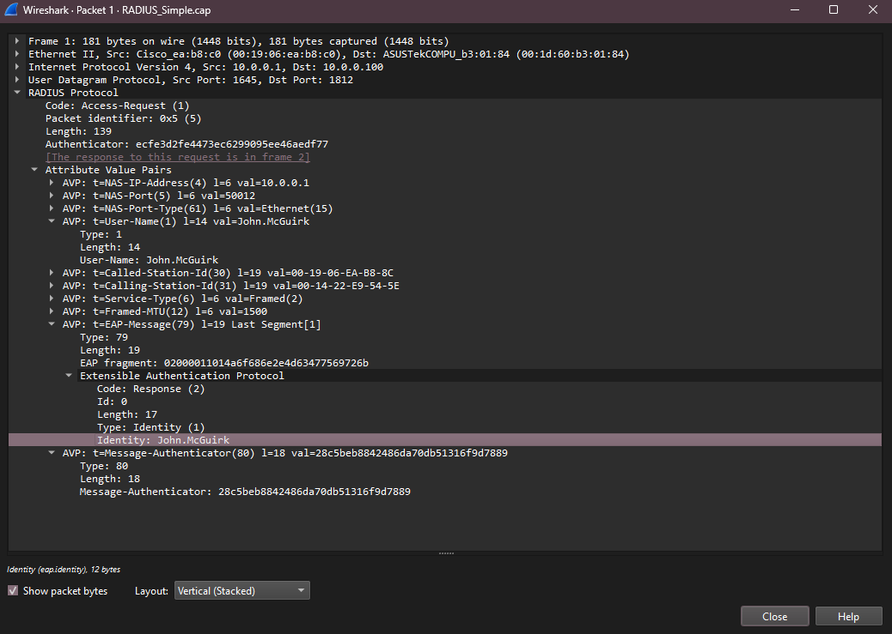
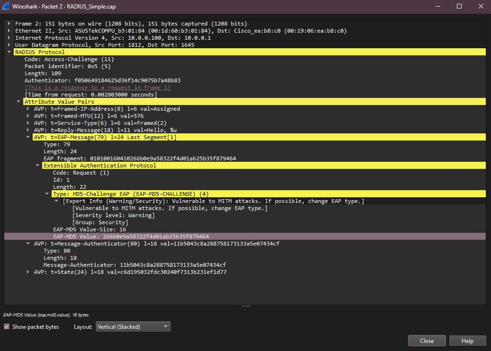
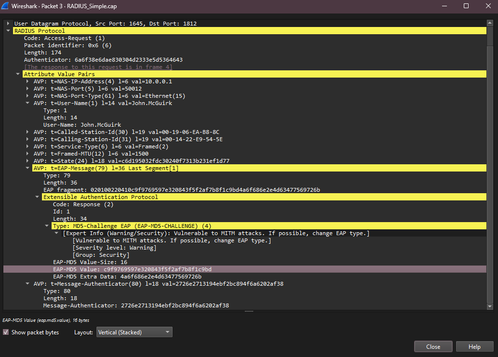
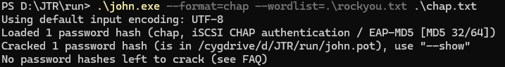
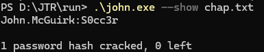

#   Exercise 1:

### 1 What kind of authentication is used in the PPP protocol?
- PAP (Password Authentication Protocol)

### 2  What are the steps for authenticating the user?
- PPP connection establishment (LCP Configuration Request/Ack). 
- PAP Authenticate-Request sent (with username and password).
- PAP Authenticate-Ack sent (authentication successful).
- Network layer (IPCP) configuration proceeds.

### 3 Identify the ”secret” password.
- The secret password is "aliceadsl"

### 4 Imagine you are a telecom provider and you provide this authentication method to your clients, what are your security considerations?
- PAP sends the password in plaintext, making it vulnerable to interception and eavesdropping.
- For that, it is susceptible to replay attacks, where an attacker can capture and reuse authentication messages.

#   Exercise 2: 
### 1 Describe the Radius protocol that you see (What it does, what purpose it serves and its security considerations).
- Unlike the PPP protocol, RADIUS makes sure that the password is not sent in plaintext. It uses a shared secret/encryption method to protect the password during transmission.
- Each of the Access-Request include an Id, and when inspected closely we can see the Username in plain text, however not the password.

### 2 Describe the Challange Authentication Principle?
- The Challenge-Response Authentication Principle is a security mechanism used to verify the identity of a user or device without transmitting the actual password over the network. It involves a challenge issued by the server and a response generated by the client based on that challenge.

### 3 Crack the credential using any password cracker such as JohnTheRipper or Hashcat.
- The password was cracked using JohnTheRipper with the following command:
  - I installed the tool: https://github.com/openwall/john-packages/releases
  - I installed a wordlist: In this case I used the rockyou.txt wordlist.
  - I went to WireShark and opened the Radius_Simple.cap file.

  

    - In order to performe this attack we will need the following information:
  
      - The nickname of the user: Found on the first Access-Request packet, in this case "John.McGuirk".
      
      
      
      - The challenge value: Found on the Access-Challenge packet, in this case "266b0e9a58322f4d01ab25b35f879464".
      
      
      
      - The response value: Found on the second Access-Request packet, in this case "c9f9769597e320843f5f2af7b8f1c9bd"
      
      

  - With all the information we can start to perform the attack:
  
    - I created a file called "chap.txt" using the following command:
    
     - ` John.McGuirk:$chap$01*266b0e9a58322f4d01ab25b35f879464*c9f9769597e320843f5f2af7b8f1c9bd' | Out-File -NoNewline -Encoding ASCII .\chap.txt`
    
    - I ran JohnTheRipper with the following command:
    
     - `.\john.exe --format=chap --wordlist=.\rockyou.txt .\chap.txt`
    
     - However, it did not show the password
    
    
    
     - So I ran this command to see if it was working:
    
       - `.\john.exe --show chap.txt`
       
    
    
       - And it showed the nickname alongside the password: "John.McGuirk:S0cc3r"

### 4 While it is cracking comment on the resilience of the cipher.
- While cracking, it became clear that the security of the cipher relies on the password's complexity. The MD5-based challenge-response can be brute-forced easily if the password is weak. Modern hardware and tools make MD5 challenge-response resilient only for strong, unique passwords; otherwise, it is vulnerable to fast offline attacks.

PL 1 EXERCICIO 2
PL 2 EXERCICIO 3