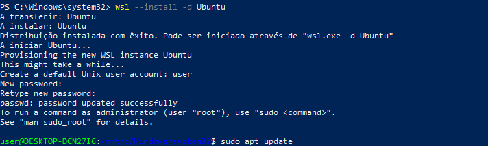
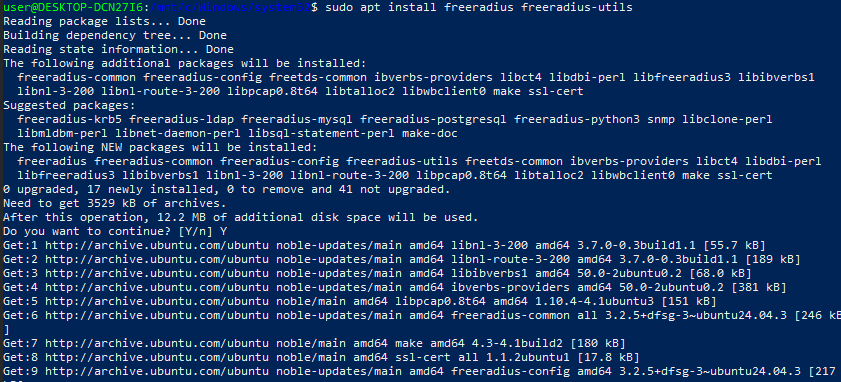
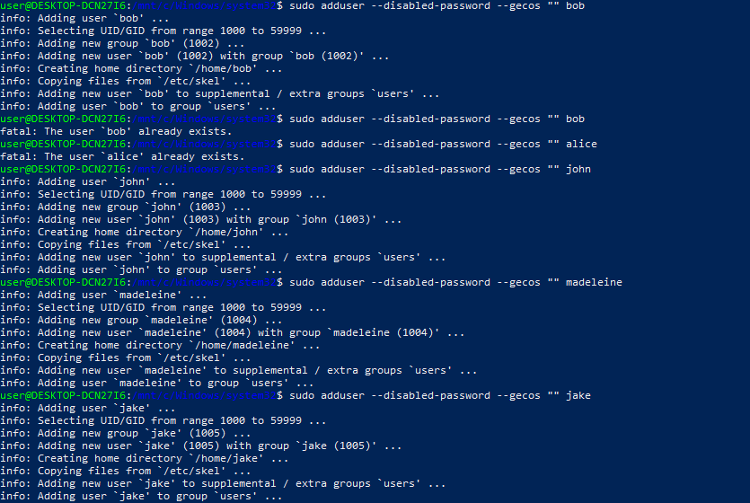
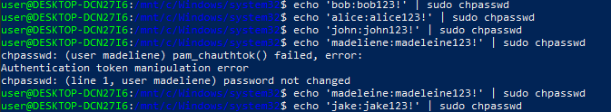
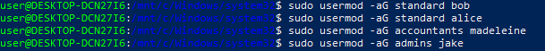
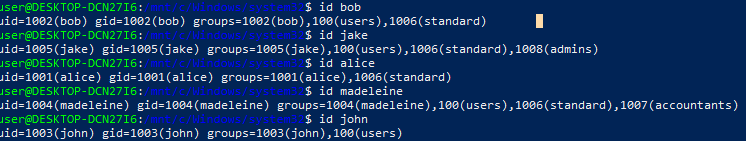
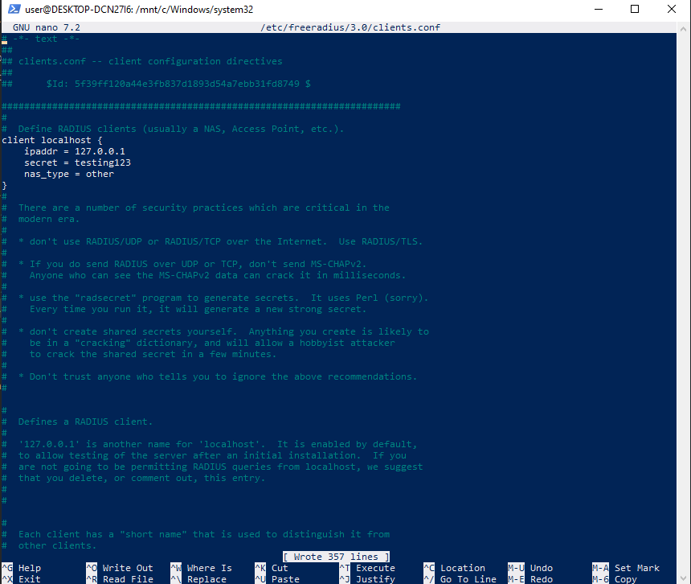
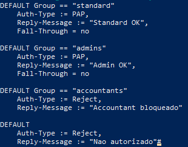

# Exercise 1

1. Install FreeRadius on your virtual machine;
- First things first I installed WSL2 on my windows with ubuntu and updated it to the latest version.

- Then I installed FreeRadius with the command: *sudo apt install freeradius freeradius-utils* 

2. Create users on your machine: Bob, Alice, John, Madeleine, and Jake;

- I created the users with the command: *sudo adduser --disabled-password --gecos "" "<username>*

- And later added passwords to them with the command: echo 'username:username123!' | sudo chpasswd

3. Bob and Alice are standard users, Madeleine is an accountant, and Jake is the the ”IT Guy” (Administrator). Create the necessary groups;
- For this I used the command: *sudo groupadd <groupname>* and later added each user to the correct group with the command: *sudo usermod -aG <groupname> <username>*

4. Configure FreeRadius such that it accepts authentications from Users and the Administrator only;

- First I search each user id
- 

- I added the code in white in this file: *sudo nano /etc/freeradius/3.0/clients.conf*

- I added the code in white in this file: *sudo nano /etc/freeradius/3.0/mods-config/files/authorize*
- 
*