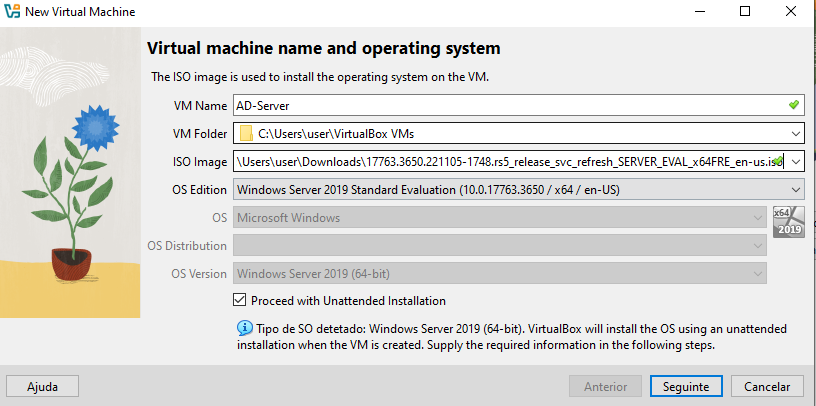
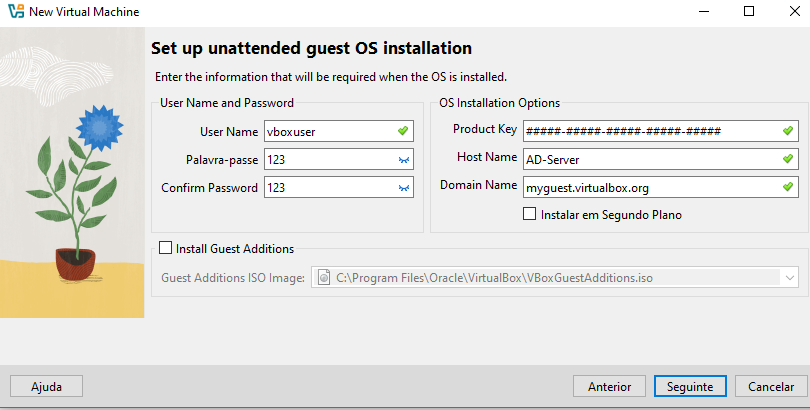
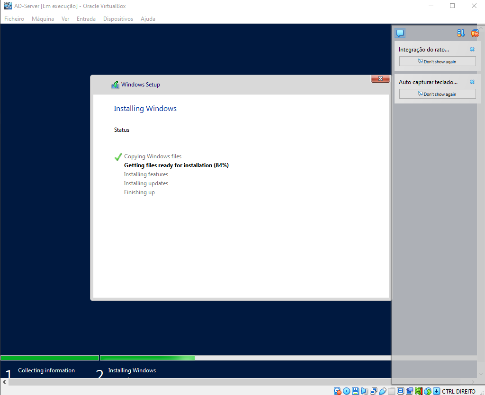
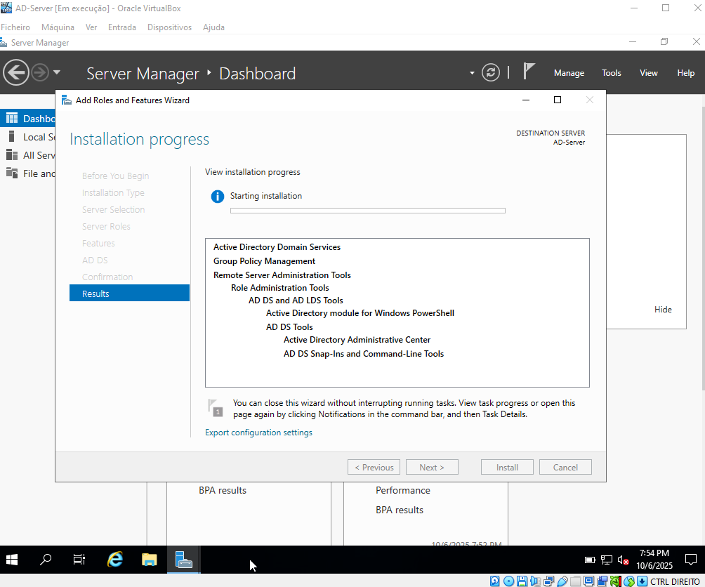
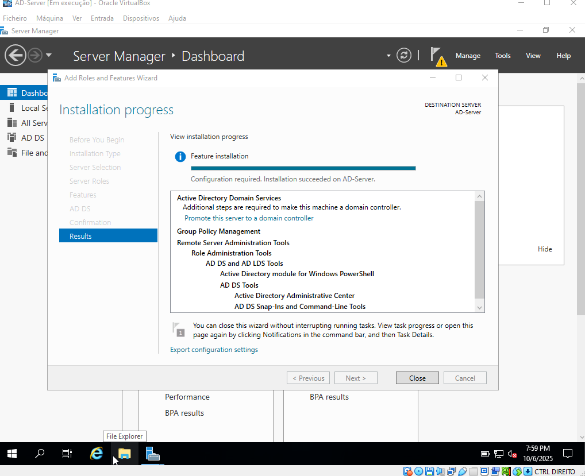
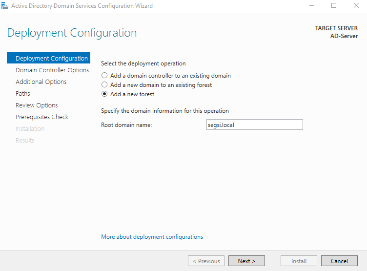
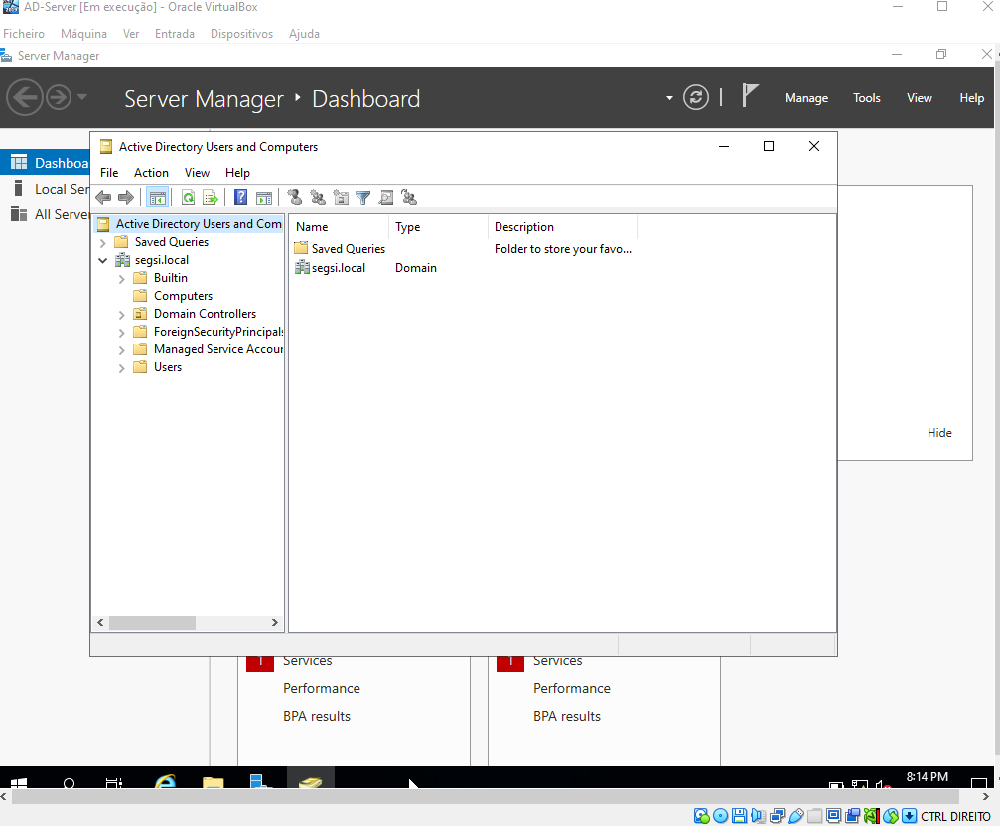

# Exercise 1

## 1. Download a Trial image from Microsoft Download Center of Windows 2019 [1], 2. Install it on a Virtual Machine and 3. Update the installation with all patches

- Instalei a VirtualBox no meu computador, de forma a criar e correr máquinas virtuais.

- Depois, fiz download da imagem de avaliação do Windows Server 2019 em versão ISO, a partir do site oficial da Microsoft.

- Quando ambos os downloads terminaram, criei uma nova máquina virtual na VirtualBox, atribuindo-lhe o ISO do Windows Server 2019 como disco de arranque. Chamei-lhe AD-Server

- Aloquei 1 CPU, 4 Gb de RAM e 50 Gb de disco rígido à máquina virtual.

- Depois, iniciei a máquina virtual e segui o processo de instalação do Windows Server 2019.

- Uns minutos depois tinha então o Windows Server 2019 instalado e a correr na minha máquina virtual.

## 4. Promote your server to Domain Controller

- Dentro do Server Manager, e segui os passos onde selecioneio "Active Directory Domain Services”.

- Após instalação apareceu-me um aviso a dizer que o servidor precisava de ser promovido a controlador de domínio.

- Cliquei no aviso e criei uma nova floresta, com o nome de domínio "segsi.local".

- Defini a password : "123#a"

- Avançei até poder instalar, e no final a VM reiniciou-se automaticamente.

- Após o reinício, fiz login com o utilizador "Administrator" e a password que defini anteriormente e verifiquei que o servidor já estava promovido a controlador de domínio "segsi.local".

