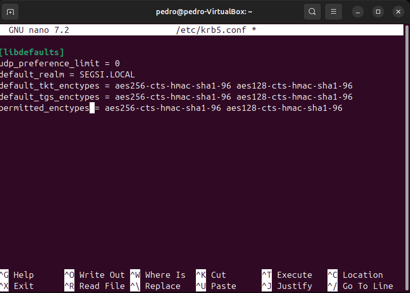
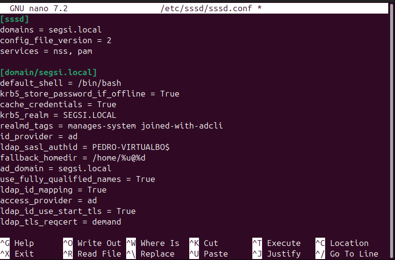

# Exercise 1

## 1. Download a Trial image from Microsoft Download Center of Windows 2019 [1], 2. Install it on a Virtual Machine and 3. Update the installation with all patches

- Instalei a VirtualBox no meu computador, de forma a criar e correr máquinas virtuais.

- Depois, fiz download da imagem de avaliação do Windows Server 2019 em versão ISO, a partir do site oficial da Microsoft.

- Quando ambos os downloads terminaram, criei uma nova máquina virtual na VirtualBox, atribuindo-lhe o ISO do Windows Server 2019 como disco de arranque. Chamei-lhe AD-Server

- Aloquei 1 CPU, 4 Gb de RAM e 50 Gb de disco rígido à máquina virtual.

- Depois, iniciei a máquina virtual e segui o processo de instalação do Windows Server 2019.

- Uns minutos depois tinha então o Windows Server 2019 instalado e a correr na minha máquina virtual.

## 4. Promote your server to Domain Controller

- Dentro do Server Manager, e segui os passos onde selecioneio "Active Directory Domain Services”.

- Após instalação apareceu-me um aviso a dizer que o servidor precisava de ser promovido a controlador de domínio.

- Cliquei no aviso e criei uma nova floresta, com o nome de domínio "segsi.local".

- Defini a password : "123#a"

- Avançei até poder instalar, e no final a VM reiniciou-se automaticamente.

- Após o reinício, fiz login com o utilizador "Administrator" e a password que defini anteriormente e verifiquei que o servidor já estava promovido a controlador de domínio "segsi.local".

## Exercise 2

## 1. Create a new Linux Virtual Machine and add it to the newly created Domain

- Criei uma nova máquina virtual na VirtualBox, desta vez com o Ubuntu 24.04.03 LTS Desktop, após ter instalado o ficheiro ISO do site oficial.

- Após isso segui os passos de instalação do Ubuntu.

- Após a instalação, reiniciei a máquina virtual, iniciei ambas e verifiquei se estavam no mesmo segmento de rede: *192.168.1.**

- Depois testei o DNS através do Ubuntu para o IP do servidor AD com o comando: *nslookup segsi.local 192.168.1.152*

- E de seguida atualizei o ficheiro *resolv.conf* com o comando: *sudo nano /etc/resolv.conf* e adicionei a linha: *nameserver: 192.168.1.152*, para conseguir resolver o domínio segsi.local.

- Com as conexões de rede e DNS a funcionar, vamos então passar a adicionar o Ubuntu ao domínio segsi.local.

- Primeiro atualizei os pacotes com o comando: *sudo apt update*
- Depois instalei os pacotes necessários com o commando : *sudo apt install realmd sssd adcli samba-common samba-common-bin oddjob oddjob-mkhomedir packagekit*

- Quando a instalação terminou, verifiquei se o domínio segsi.local era descoberto com o comando: *realm discover segsi.local*

- Após sucesso, juntei o Ubuntu ao domínio com o comando: *sudo realm join segsi.local -U Administrator* Que adiciona o Ubuntu ao domínio do Active Directory, usando o utilizador “Administrator” do Windows Server. Que pediu a password desse utilizador para autenticação.
- Após isso, verifiquei se o Ubuntu estava mesmo adicionado ao domínio com o comando: *realm list*

- Após juntar o Ubuntu ao domínio “segsi.local”, o comando id Administrator@segsi.local mostra que o sistema reconhece o utilizador e os respetivos grupos do Active Directory.
  Isto valida que a autenticação e a gestão de utilizadores do domínio AD já estão operacionais no Ubuntu.

## 2. Create the necessary Group Policies to ensure that Auditing is correctly implemented

- No Windows Server, abri o "Group Policy Management" a partir do "Server Manager".
- Criei uma nova GPO (Group Policy Object) chamada "Test" e editei-a para adicionar as políticas de auditoria necessárias:

  - Account Logon
      - Regista autenticações de contas do domínio.
  - Account Management
    - Regista criação, alteração ou eliminação de contas/grupos.
  - Logon/Logoff
    - Regista logins e logoffs nas máquinas do domínio.
  - Object Access
    - Para ver quem acedeu a ficheiros, pastas, impressoras, etc.
  - Policy Change
    - Deteta alterações a políticas de segurança.
  - Privilege Use
    - Regista uso de privilégios elevados (admin, sudo, etc).
  - Detailed Tracking
    - Para monitorizar eventos detalhados como criação/terminação de processos.
  - System
    - Regista eventos do sistema (arranque, encerramento, falhas, etc).

- Depois de configurar as politicas, no terminal corri gpupdate /force para aplicar as novas políticas imediatamente.

- Para verificar se as políticas de auditoria estão a funcionar, abri o "Event Viewer" no Windows Server e naveguei até "Windows Logs" > "Security". Aqui, posso ver os eventos de auditoria gerados pelas ações dos utilizadores e do sistema. 

## 3. Harden your Authentications services
   ### (a) Block insecure ciphers from encrypting Kerberos Tickets
- No Windows Server, abri o "Group Policy Management" e editei a GPO "Test" que criei anteriormente.
- Naveguei até "Computer Configuration" > "Policies" > "Windows Settings" > "Security Settings" > "Local Policies" > "Security Options".
- Encontrei a política "Network security: Configure encryption types allowed for Kerberos" e editei-a.
- Desmarquei os tipos de encriptação inseguros, como DES e RC4, deixando apenas os tipos seguros como AES256 e AES128.

- Do lado do Ubuntu, editei o ficheiro /etc/krb5.conf para garantir que apenas os tipos de encriptação seguros são usados. Adicionei ou modifiquei a seção [libdefaults] para incluir:

- E corri estes comandos para reiniciar os serviços relacionados com Kerberos e SSSD:

- Para verificar se as alterações foram aplicadas corretamente, usei o comando klist no Ubuntu para listar os tickets Kerberos e confirmar que estão a usar os tipos de encriptação seguros.

   ### (b) Ensure that LDAP sign and seal is applied

- No Windows Server, abri o "Group Policy Management" e editei a GPO "Test".

- Naveguei até "Computer Configuration" > "Windows Settings" > "Security Settings" > "Local Policies" > "Security Options".
- Encontrei a política "Domain controller: LDAP server signing requirements" e defini-a como "Require signing".

- E forcei a atualização das políticas com o comando gpupdate /force no terminal.

- No Ubuntu, editei o ficheiro /etc/sssd/sssd.conf para garantir que a ligação LDAP ao Active Directory usa assinatura e encriptação.

- Reiniciei o serviço SSSD para aplicar as alterações: *sudo systemctl restart sssd*

### (c) Verify that your Linux server can still connect

- E voltei a testar

# Exercise 3 : Attacks on Active Directory/Kerberos

## Due to its expansion and adoption Active Directory environments have a huge attack surface. In order to understand how can we abuse it try to accomplish the following

### Deploy BadBlood on your testing domain 

- Abri então o PowerShell no Windows Server como Administrador e corri estes comandos para instalar o BadBlood e correr:

### Download and run Bloodhound

- No Windows Server, abri o powershell como Administrador e corri estes comandos para instalar o BloodHound:

- Mal acabei de instalar, o antivírus Windows Defender detetou o BloodHound como uma potencial ameaça.

- Para contornar isto, adicionei uma exceção no Windows Defender para a pasta onde o BloodHound está instalado.

- Já com o ficheiro corretamente colocado no Desktop, desloquei-me para o Desktop e corri o BloodHound com o comando:

- Com a ajuda de uma PEN passei o ficheiro para o meu computador local.

## Install Neo4J Desktop [5] and load your results into the Database using the BloodHound binaries

- Instalei o Neo4J Desktop no meu computador a partir do site oficial que está presente na aula PL03.

- Após a instalação, abri o Neo4J Desktop e criei uma nova base de dados chamada "SEGSI-PL03".

- No BloodHound, cliquei em "Connect" e preenchi os detalhes da conexão com a base de dados Neo4J:

- Dentro do BloodHound, cliquei em "Upload Data" e selecionei o ficheiro JSON que exportei anteriormente com o BadBlood. E esperei que o upload fosse concluído.

## Try to trace a potential attack vector and how could you exploit it using the Hacktricks Database

- Através do BloodHound já com os dados, desloquei-me até à aba de Analysis que inclui várias queries pré-definidas para identificar potenciais vetores de ataque. Selecionei a query "Find  All Domain Admins" para identificar os alvos principais, administradores de domínio.
- Este foi o resultado:

- De forma a tentar encontrar um vetor de ataque, selecionei cada um dos nós e explorei as suas relações com outros objetos no domínio, como grupos, computadores e permissões delegadas.

- Vetor de Ataque: Foi identificado um vetor de ataque de criticidade máxima. A conta GALE_MCDONALD@SEGSI.LOCAL é membro direto do grupo DOMAIN ADMINS.

- Análise da Exploração (com base no Hacktricks): Conforme documentado na metodologia de análise do Active Directory do Hacktricks, o grupo Domain Admins detém o nível de privilégio mais elevado. A exploração deste vetor consiste no comprometimento das credenciais do utilizador GALE_MCDONALD. Uma vez obtido o acesso, um atacante teria imediatamente a capacidade de:

- Aceder e administrar todos os Domain Controllers, podendo extrair a base de dados de passwords de todo o domínio.

- Modificar a pertença de qualquer grupo, permitindo a criação de contas "backdoor" com privilégios persistentes.

- Alterar Group Policies (GPOs) para desativar defesas de segurança em toda a rede ou para distribuir malware.

- O comprometimento de uma única conta neste grupo resulta no comprometimento total e imediato de todo o domínio segsi.local.

